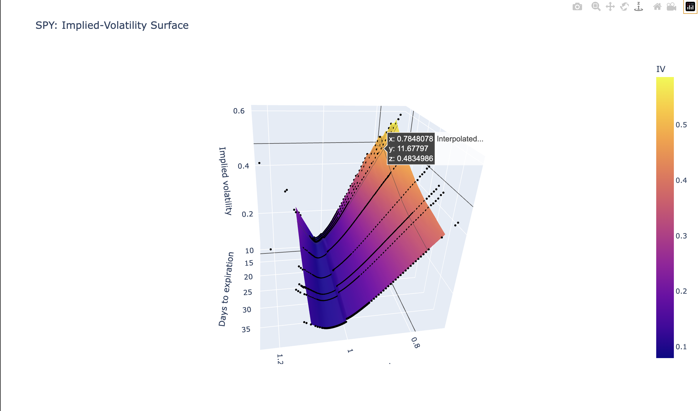
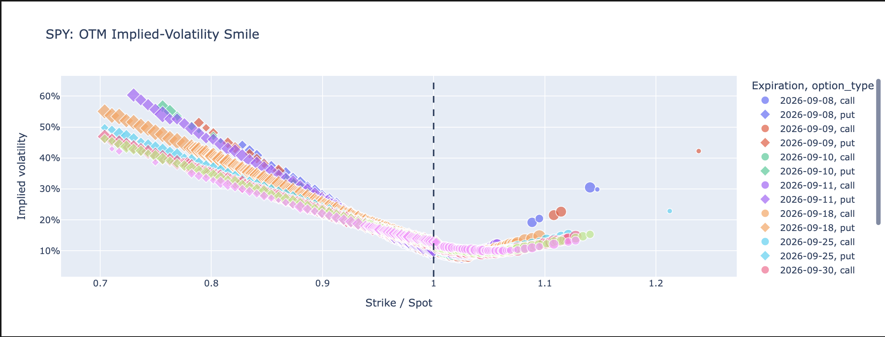
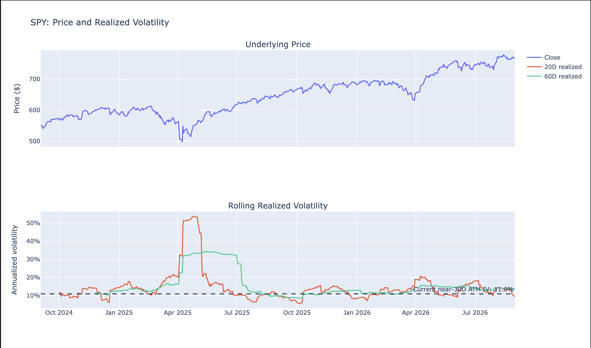

# Options Volatility Surface and Greeks Dashboard

This project analyzes SPY options by calculating implied volatility and Greeks, then visualizing volatility, liquidity, and option sensitivities across strikes and expiration dates.

## Features

- Pulls and cleans SPY option-chain data
- Calculates Black-Scholes implied volatility
- Calculates Delta, Gamma, Vega, Theta, and Rho
- Visualizes volatility smiles and term structure
- Builds a 3D implied volatility surface
- Analyzes bid-ask spreads and Greek sensitivities
- Compares implied volatility with historical realized volatility

## Visualizations

### Implied Volatility Surface

### Volatility Smile

### Implied vs Realized Volatility

## Tools

- Python
- Pandas
- NumPy
- SciPy
- yfinance
- Plotly

## How It Works

The notebook pulls SPY price and option-chain data from Yahoo Finance, filters unusable quotes, and uses market midpoint prices to solve for implied volatility with the Black-Scholes model.

It then calculates option Greeks and uses the cleaned data to analyze volatility across strikes and expiration dates, liquidity, option sensitivities, and historical realized volatility.

## Notebook

The full analysis and code are available in:

`SPY_Options_Volatility_Surface_and_Greeks_Dashboard.ipynb`
